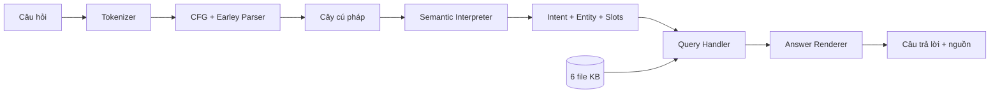

# BÁO CÁO BÀI TẬP LỚN NLP — COURSE ASSISTANT

> Bản nháp nội dung. Nhóm bổ sung tên trường/lớp, giảng viên, họ tên, MSSV, ảnh
> Docker chạy thành công và đường dẫn video trước khi xuất bản báo cáo chính thức.

## Tóm tắt

Nhóm xây dựng Course Assistant trả lời câu hỏi về môn học từ knowledge base mẫu.
Hệ thống đi theo hướng Classical NLP dựa trên luật: chuẩn hóa câu, phân tích bằng
CFG và Earley parser, diễn giải cây thành intent/entity, truy vấn dữ kiện có nguồn
và dựng câu trả lời tiếng Việt. Cách thiết kế này giúp quan sát được từng bước,
phân biệt câu ngoài phạm vi với dữ kiện bị thiếu, và không tạo thông tin không có
trong KB. Trên bộ 28 câu có nhãn hệ thống đạt 28/28; trên 13 câu challenge do nhóm
tự viết đạt 11/13. Hai lỗi còn lại đều do độ phủ grammar.

## 1. Bài toán và phạm vi

Đầu vào là câu hỏi tự nhiên về môn NLP. Hệ thống hỗ trợ bảy nhóm bắt buộc: thông
tin chung, chủ đề, lịch học, bài tập, deadline, tài liệu và quy định. Đầu ra gồm
cây cú pháp, semantic representation, intent/entity, truy vấn KB, nguồn và câu
trả lời. Hội thoại và LLM/RAG là phần tùy chọn; kết quả chính của nhóm không phụ
thuộc hai phần này.

Nhóm chọn Classical NLP vì bài toán có miền hẹp, dữ liệu có cấu trúc và cần giải
thích rõ cách câu hỏi được xử lý. Không có LLM trong pipeline cốt lõi.

## 2. Kiến trúc



Các module giao tiếp bằng hai kiểu dữ liệu chính. `SemanticFrame` gồm intent,
entity, slots và nhánh grammar nguồn. `QueryResult` gồm đường truy vấn, trạng thái,
dữ liệu, nguồn và lý do khi không tìm thấy. Nhờ hợp đồng này, query không phải
đọc lại câu thô và answer không tự truy cập KB.

## 3. Grammar, tokenizer và parser

`grammar.cfg` là nguồn CFG chung của parser và generator. Nhóm `Q_*` xác định loại
câu hỏi; các constituent như tuần, chương, chủ đề và phần bài tập cung cấp thực
thể. Dữ kiện khóa học không nằm trong grammar.

Tokenizer chuẩn hóa Unicode NFC, chữ hoa/thường, khoảng trắng và dấu câu, đồng
thời giữ các ID quan trọng như `CO3085`, `L.O.2.5` hoặc `LLM/RAG`. Parser Earley
dùng predictor, scanner và completer. Một câu chỉ hợp lệ khi item bắt đầu ở `S`
hoàn thành tại vị trí cuối token. Điều này ngăn việc chấp nhận một tiền tố hợp lệ
nhưng bỏ qua token dư.

Generator duyệt cùng CFG với giới hạn độ dài, số trạng thái và tối đa 10.000 câu
duy nhất. Bộ kiểm thử parse lại các câu sinh ra để phát hiện lệch giữa hai phía.

## 4. Semantic, intent và entity

Semantic interpreter không suy intent từ KB. Nó đọc nhánh `Q_*` trên cây và ánh
xạ alias thành ID chuẩn. Ví dụ:

```text
“Tuần 3 học gì?”
→ Q_SCHEDULE_WEEK + WEEK_NUMBER 3
→ GET_SCHEDULE(week=WEEK_03)
→ intent GET_SCHEDULE, entity WEEK_03
```

Lexicon thực thể tách alias bề mặt khỏi ID nội bộ. Vì vậy “môn NLP” và “CO3085”
có thể cùng ánh xạ về `CO3085`; “chương 4” về `CH04`. `source_branch` được giữ lại
để truy vết luật grammar nào đã tạo semantic frame.

## 5. Knowledge base, query và answer

KB gồm sáu file: thông tin môn học, lịch, chủ đề, bài tập, tài liệu và quy định.
Loader kiểm tra cú pháp, ID trùng và tham chiếu bị gãy, sau đó tạo chỉ mục theo
tuần, chương, chủ đề, phần và learning outcome. Mỗi record giữ tên file và ID làm
nguồn.

Query handler chọn phép tra dựa trên intent và slots. Ví dụ `WEEK_03` tạo đường
`KB.weeks[WEEK_03]`. Khi tìm được dữ kiện, answer renderer dùng template phù hợp
và trả nguồn. Khi semantic hợp lệ nhưng KB thiếu fact, trạng thái là `NOT_FOUND`.
Khi parser thất bại, trạng thái là `OUT_OF_SCOPE`. Deadline ngày cụ thể là ví dụ
`NOT_FOUND` vì KB mẫu chỉ mô tả mốc bài tập mà không cung cấp ngày.

## 6. Ví dụ end to end

Với câu “Tuần 3 học gì?”, hệ thống tạo token `tuần`, `3`, `học`, `gì`, `?`; cây
có nhánh `Q_SCHEDULE_WEEK`; semantic là `GET_SCHEDULE(week=WEEK_03)`; query đọc
record `schedule.txt:WEEK 03`; answer liệt kê Chương 3 và các chủ đề trong record.
Toàn bộ dữ kiện trong đáp án có thể truy ngược về nguồn này.

Ví dụ trên thể hiện ranh giới quan trọng: grammar nhận cấu trúc câu, semantic tạo
ý định và ID, còn KB mới cung cấp nội dung môn học.

## 7. Đánh giá

Nhóm dùng hai bộ câu độc lập về báo cáo. `gold_queries.txt` chứa 25 câu lõi và ba
câu ngoài miền, có nhãn intent, entity, query status và mảnh đáp án. Bộ challenge
gồm 13 cách diễn đạt và ca biên do nhóm tự viết. Câu được chạy độc lập, không dùng
ngữ cảnh hội thoại.

| Tầng | Tiêu chí đúng |
| --- | --- |
| Parse | Có cây phủ toàn token với câu trong miền; `()` với câu UNKNOWN. |
| Intent | Trùng intent chuẩn. |
| Entity | Trùng ID chuẩn. |
| Query | Trùng status; `FOUND` phải có nguồn. |
| Answer | Chứa các mảnh bằng chứng đã gán nhãn. |

| Bộ câu | Kết quả |
| --- | ---: |
| Q001–Q028 | 28/28 (100%) |
| Challenge | 11/13 (84,6%) |
| Tổng trên nhãn đã khai báo | 39/41 (95,1%) |

Bộ Q001–Q028 đã tham gia quá trình phát triển nên 100% ở đó là hồi quy, không phải
ước lượng trên người dùng mới. Bộ challenge còn hai lỗi: “Tuan 3 hoc gi?” thiếu
dấu và “Số tín chỉ của môn NLP là bao nhiêu?” dùng trật tự chưa có luật. Cả hai
không tạo được cây, vì vậy các tầng semantic/query/answer phía sau cũng thất bại.

## 8. Ưu điểm và hạn chế

Ưu điểm:

- Mỗi quyết định có thể giải thích qua token, cây, semantic và nguồn KB.
- Grammar không trộn dữ kiện; KB không đoán intent từ câu thô.
- Phân biệt rõ `FOUND`, `NOT_FOUND` và `OUT_OF_SCOPE`.
- Không cần model lớn, API hoặc mạng khi chạy.
- Một lệnh batch tái tạo toàn bộ đầu ra và báo cáo đánh giá.

Hạn chế:

- Rule based grammar bỏ sót cách nói mới, câu thiếu dấu và lỗi chính tả.
- Mở rộng miền cần bổ sung grammar, alias, semantic mapping và test tương ứng.
- KB chỉ là dữ liệu mẫu, thiếu lịch thi, giảng viên và ngày deadline cụ thể.
- Đánh giá answer bằng mảnh bằng chứng chưa đo đầy đủ độ tự nhiên của câu.
- Hội thoại có ngữ cảnh chưa nằm trong kết quả bắt buộc.

## 9. Môi trường và khả năng tái tạo

Chương trình dùng Python 3.10+ và thư viện chuẩn. Dockerfile dùng Python 3.12 slim,
đặt UTF-8 và mặc định chạy batch. `package_submission.py` kiểm tra cấu trúc, đầu
ra thẳng hàng, JSON Lines, grammar, giới hạn 10.000 câu và ZIP dưới 10 MB.

> Chèn ảnh hoặc log `docker build` và `docker run` của bản ZIP đã giải nén tại đây.

## 10. Kết luận

Hệ thống đã hoàn thành pipeline Classical NLP bắt buộc cho bảy nhóm câu hỏi và
tạo câu trả lời có căn cứ từ KB. Thiết kế theo tầng giúp chẩn đoán lỗi và đánh giá
trung thực. Hướng phát triển phù hợp là tăng độ phủ paraphrase, xử lý câu không dấu
và chỉ sau đó mới bổ sung hội thoại hoặc retrieval mở rộng.

## Phụ lục: thông tin cần điền

- Thành viên và MSSV: **nhóm bổ sung**.
- Phân công thực tế: **nhóm xác nhận**.
- Link video: **nhóm bổ sung sau khi quay**.
- Log/ảnh Docker: **nhóm bổ sung sau khi smoke test**.
- Nguồn dữ liệu: bộ Course Assistant sample data do ban tổ chức môn học cung cấp;
  grammar, alias chuẩn hóa và bộ challenge do nhóm xây dựng.
